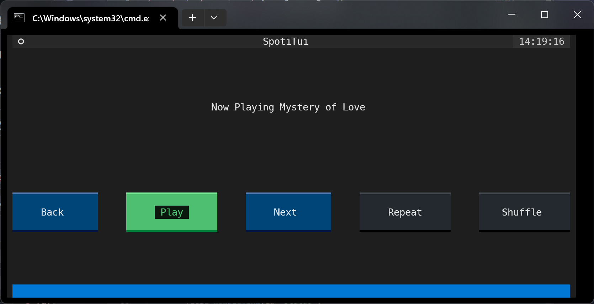

# Terminal Spotify 

This is a minimal example project created using [Unofficial-Spotify-Playback](https://github.com/Om-Thorat/Unofficial-Spotify-Playback) api.

⚠️ You need [Spicetify](https://Spicetify.app) installed with the [PlaybackApi](https://github.com/Om-Thorat/Unofficial-Spotify-Playback) extension for this demo to work.

## Steps to run locally

* clone the repo

* move into the folder 

`cd Term-Spotify`

* Install dependencies

`pip install -r requirements.txt`

* Start the Spotify app

* Run App.py and Voila ✨

It should be up and running.  
If you face any issues please create one.

## Contributing 

This works based on websockets where the app.py starts a server and the playbackapi extension injected into spotify works as a client.

If you want to create a project or bindings for the api in another language feel free to do so, contact me on discord `Not Om#7635` or Mail me `thoratom1104[dot]@gmail[dot]com` for any questions.